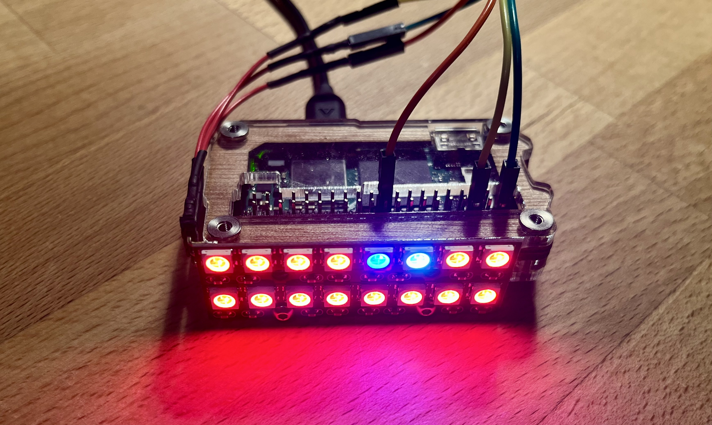

[](https://github.com/wolfpaulus/ZeroMonitor/actions/workflows/python-test.yml)

# ZeroMonitor

Using the Raspberry Pi Zero 2 W for hardware monitoring


_-1st prototype of ZeroMonitor with two 8-NeoPixels sticks-_

ZeroMonitor is a lightweight, customizable system monitor built for Raspberry Pi. 
It checks the health of remote computers agentless (via SSH) and visualizes the results 
using a strip of NeoPixels — one (or more) Pixels per host.

### Highlights
- Remote monitoring with SSH (secure, non-invasive, no agents required)
- Real-time visual feedback using NeoPixels
- Alternative display options using an (e-paper) which updates every 2 minutes
- Customizable modular design (clean OOP in Python) — easy to add new monitors
- CI/CD-style automatic updates with a simple polling strategy (cron):
  - Check for updates from GitHub
  - Redeploy itself if an update is available

## BOM (Bill of Materials) <= $50
- [Raspberry Pi Zero 2 W](https://www.raspberrypi.com/products/raspberry-pi-zero-2-w/) $15
- [NeoPixels, e.g. 8x NeoPixel sticks](https://www.waveshare.com/product/raspberry-pi/hats/led-buttons/rgb-led-hat.htm) $11
- [Alternatively: E-Paper display, e.g. Waveshare 2.13inch e-Paper HAT+](https://www.waveshare.com/product/raspberry-pi/displays/e-paper/2.13inch-e-paper-hat-plus.htm) $17
- [Power supply - 5V, 2A recommended](https://www.raspberrypi.com/products/micro-usb-power-supply/) $9
- (reasonably fast) MicroSD card (8GB or larger) $8


## Example Monitors
- CPU temperature
- CPU usage
- RAM usage
- Disk space

## Visual feedback via NeoPixels (e.g.):
- Blue: low/idle
- Turquoise: below normal
- Green: medium/normal
- Orange: above medium
- Red: high
- Pink: critical
- Black/off: offline

## How It Works
The Pi connects to the monitored hosts over SSH.
Gathers system metrics using remote commands.
Evaluates thresholds and maps state to color.
Updates the corresponding NeoPixel LED.

### ./.ssh/config
To simplify SSH connections, you can set up your `~/.ssh/config` file with the following entries:

#### Example SSH Config
```plaintext
Host alpha
    User wolf
    Port 22
    HostName 192.168.200.16
    IdentityFile ~/.ssh/id_rsa

Host beta
    User wolf
    Port 22
    HostName 192.168.200.17
    IdentityFile ~/.ssh/id_rsa
```

## ⚙️ Installation
Depending on the display you want to use, you need to install different libraries.
Check here for details: [./waveshare/README.md](waveshare/README.md) 

# 🔄 CI/CD-Style Auto-Update
ZeroMonitor can automatically check for updates from GitHub and redeploy itself using a cron job.
For more details, see the [./cicd/README.md](cicd/README.md) file.
## Ansible Playbook
This ansible playbook can be used to install ZeroMonitor on a Raspberry Pi:
[./ansible/playbooks/setup-zero_mon.yml]()
