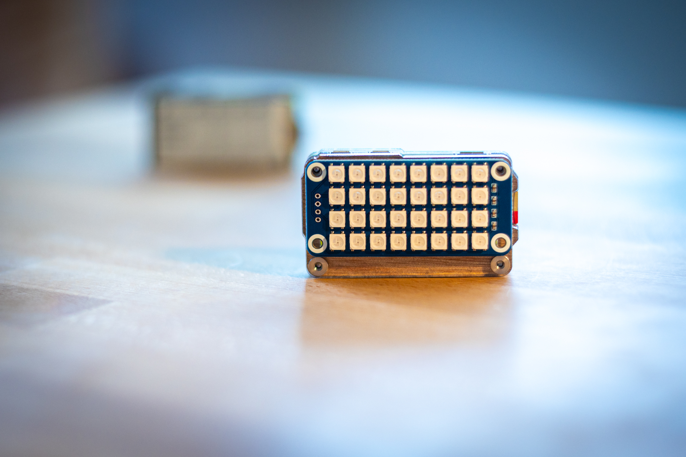
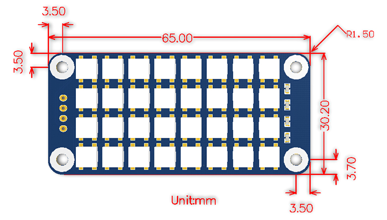
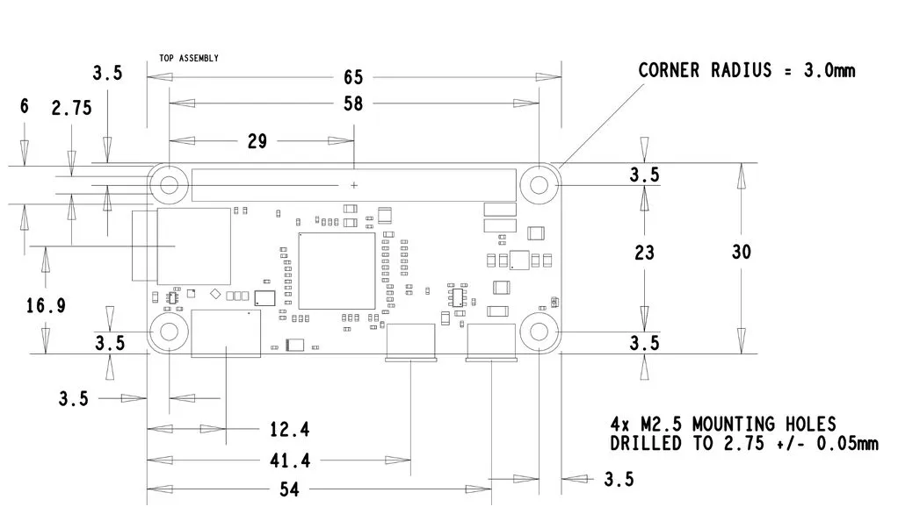
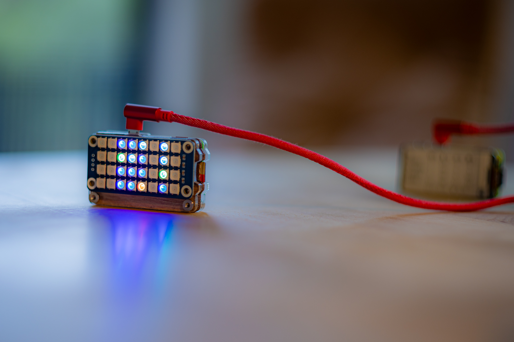
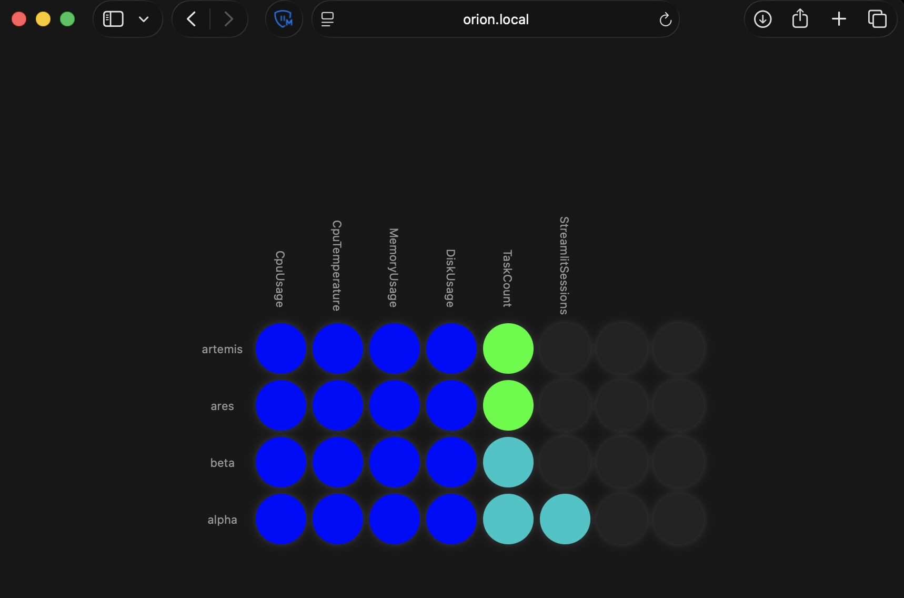
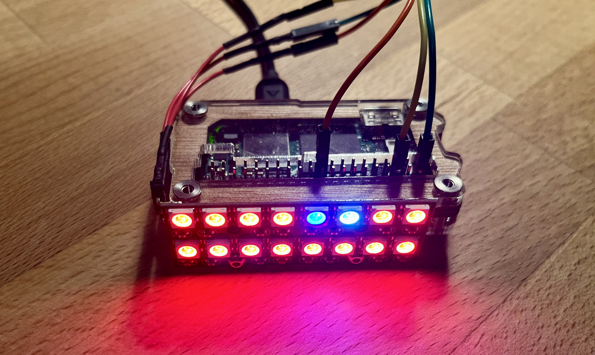

[](https://www.gnu.org/licenses/gpl-3.0)
[](https://www.python.org/downloads/)
[](https://github.com/wolfpaulus/ZeroMonitor/actions/workflows/python-test.yml)

# ZeroMonitor

**Agentless infrastructure monitoring with real-time NeoPixel visualization, built for Raspberry Pi Zero 2 W.**

<p align="center">
  
  <br>
  <em>ZeroMonitor with Waveshare 4&times;8 RGB LED HAT</em>
</p>

ZeroMonitor connects to remote hosts over SSH, collects system metrics, and maps health status to colors on a 32-LED NeoPixel grid — giving you an always-on, at-a-glance view of your infrastructure. No agents, no daemons, no open ports on your monitored machines.

---

## Highlights

- **Agentless** — monitors via SSH using key-based auth; nothing to install on target hosts
- **Real-time visual feedback** — color-coded NeoPixel LEDs update continuously
- **Configurable** — YAML-driven; define hosts, sensors, thresholds, and display modes
- **Extensible** — clean OOP design makes adding new sensor types straightforward
- **Self-updating** — CI/CD-style auto-update via cron pulls changes from GitHub and redeploys

---

## Table of Contents

- [How It Works](#how-it-works)
- [Hardware](#hardware)
- [Sensors](#sensors)
- [LED Color Map](#led-color-map)
- [Display Modes](#display-modes)
- [Web Display](#web-display)
- [Configuration](#configuration)
- [Installation](#installation)
- [Auto-Update & CI/CD](#auto-update--cicd)
- [Project Structure](#project-structure)
- [License](#license)

---

## How It Works

```
┌──────────────┐    SSH     ┌───────────────┐
│  Pi Zero 2 W │ ─────────▸ │  Host: alpha  │
│              │            └───────────────┘
│  main.py     │    SSH     ┌───────────────┐
│  ┌────────┐  │ ─────────▸ │  Host: beta   │
│  │ monitor│  │            └───────────────┘
│  └───┬────┘  │    SSH     ┌───────────────┐
│      │       │ ─────────▸ │  Host: gamma  │
│  ┌───▼────┐  │            └───────────────┘
│  │display │  │       ...up to 32 hosts
│  └───┬────┘  │
│      │       │
│  ┌───▼────┐  │
│  │NeoPixel│  │
│  │ 4 × 8  │  │
│  └────────┘  │
└──────────────┘
```

1. **Connect** — SSH into each monitored host using key-based authentication
2. **Collect** — Execute remote commands to gather metrics (CPU temp, usage, RAM, disk, etc.)
3. **Evaluate** — Compare values against configurable thresholds
4. **Visualize** — Map each sensor's state to a color and update the corresponding NeoPixel LED

---

## Hardware

**Total cost about $50**

| Component | Example | Price |
|-----------|---------|------:|
| Raspberry Pi Zero 2 W | [raspberrypi.com](https://www.raspberrypi.com/products/raspberry-pi-zero-2-w/) | ~$15 |
| NeoPixel RGB LED HAT (4&times;8) | [Waveshare RGB LED HAT](https://www.waveshare.com/product/raspberry-pi/hats/led-buttons/rgb-led-hat.htm) | ~$11 |
| 5V 2A Micro-USB power supply | [raspberrypi.com](https://www.raspberrypi.com/products/micro-usb-power-supply/) | ~$9 |
| MicroSD card (8 GB+) | Any reputable brand | ~$8 |
| Case *(optional but recommended)* | [Zebra Zero](https://c4labs.com/Zebra-Zero-for-Raspberry-Pi-Zero-Zero-Wireless--Wood-GPIO_p_578.html) | ~$11 |

<p align="center">
  
  
</p>

---

## Sensors

ZeroMonitor ships with several built-in sensor classes. Each is a subclass of `Monitor` and can be overridden per-host in the YAML config:

| Sensor | Metric | Remote Command |
|--------|--------|----------------|
| `CpuTemperature` | CPU package temp (°C) | `cat /sys/class/thermal/thermal_zone0/temp` |
| `CpuUsage` | CPU utilization (%) | `mpstat` pipeline |
| `MemoryUsage` | RAM utilization (%) | `free` |
| `DiskUsage` | Root filesystem usage (%) | `df /` |
| `TaskCount` | Number of running tasks | `ps -e | wc -l` |
| `StreamlitSessions` | Active Streamlit sessions | Streamlit metrics endpoint |

> Adding a new sensor: subclass `Monitor`, implement `probe()`, and register the class name in `monitor.yaml`.

---

## LED Color Map

Each LED maps a sensor's value to one of seven states based on configurable thresholds:

| Color | State | Meaning |
|-------|-------|---------|
| 🔵 Blue | 0 | Low / idle |
| 🔵 Cyan | 1 | Below normal |
| 🟢 Green | 2 | Normal |
| 🟡 Yellow | 3 | Above normal |
| 🔴 Red | 4 | High |
| 🟣 Pink | 5 | Critical |
| ⚫ Off | -1 | Offline / error |

<p align="center">
  
  <br>
  <em>LEDs displaying live health status across multiple hosts</em>
</p>

---

## Display Modes

The 4-row &times; 8-column NeoPixel grid supports four layout modes:

| Mode | Layout | Capacity |
|------|--------|----------|
| `1` | Single host | 1 host &times; 32 metrics |
| `2` | Horizontal | 4 hosts &times; 8 metrics (one row per host) |
| `3` | Vertical | 8 hosts &times; 4 metrics (one column per host) |
| `4` | Grid | 32 hosts &times; 1 metric (one pixel per host) |

---

### Web Display

ZeroMonitor also serves a live HTML replica of the NeoPixel grid via a built-in web server (`websvr.py`). The `WebDisplay` class runs an HTTP server on port 80 in a background thread and renders the 4&times;8 grid as colored circles in the browser — complete with host and sensor labels that adapt to the configured display mode. The page auto-refreshes every 10 seconds.

No additional dependencies required — it uses Python's standard library `http.server`.

```
http://<Pi's IP address>/
```

<p align="center">
  
  <br>
  <em>Browser-based replica of the NeoPixel grid with host and sensor labels</em>
</p>

## Configuration

### 1. SSH Key Setup (on monitored hosts)

ZeroMonitor requires SSH key-based authentication. [Generate an SSH key pair](https://www.ssh.com/academy/ssh/keygen) on the Pi, create a dedicated user (e.g. `zero`) on each target host, and add the Pi's public key:

```bash
# On each monitored host
mkdir -p /home/zero/.ssh
echo "<Pi's public key>" >> /home/zero/.ssh/authorized_keys
chmod 600 /home/zero/.ssh/authorized_keys
```
.. or maybe you already have SSH keys set up for your hosts — just ensure the Pi can connect passwordlessly.

> **This is the only setup required on monitored hosts.** No agents, daemons, or additional software needed.

### 2. SSH Config (on the Pi)

Since the monitoring script runs as root (required for GPIO access to the NeoPixels) and is launched via cron, create `/root/.ssh/config` to simplify connections:

```
Host alpha
    User zero
    Port 22
    HostName 192.168.200.16
    IdentityFile ~/.ssh/id_rsa

Host beta
    User zero
    Port 22
    HostName 192.168.200.17
    IdentityFile ~/.ssh/id_rsa
```

This lets the code reference hosts by alias (e.g. `alpha`, `beta`) with no hardcoded IPs, ports, or credentials.

### 3. Monitoring Configuration (`monitor.yaml`)

All monitoring behavior is defined in a single YAML file — hosts, sensors, thresholds, display settings:

```yaml
displays:
  neopixel:
    brightness: 127       # LED brightness (24–255)
    sensor_timeout: 1     # Pause (seconds) between sensor probes
    on_: "6:30"           # LEDs on at 6:30 AM
    off_: "22:00"         # LEDs off at 10:00 PM
    mode: 3               # Vertical: up to 8 hosts × 4 sensors

sensors:
  CpuUsage:
    name: CpuUsage
    description: CPU usage percentage
    cmd: mpstat -P ALL 1 1 | awk '$1 == "Average:" && $2 == "all" { print 100 - $NF }'
    values: [3, 15, 30]   # Thresholds: idle, normal, high

  CpuTemperature:
    name: CpuTemperature
    description: CPU package temperature in Celsius
    cmd: cat /sys/class/thermal/thermal_zone0/temp
    values: [50, 62, 75]  # Thresholds: low, normal, high

  MemoryUsage:
    name: MemoryUsage
    description: Memory usage percentage
    cmd: free
    values: [25, 50, 75]

  DiskUsage:
    name: DiskUsage
    description: Disk usage percentage
    cmd: df /
    values: [30, 55, 80]

hosts:
  - hostname: alpha
    details: NUC Core i5 16GB 256GB SSD
    CpuTemperature:
      cmd: cat /sys/class/thermal/thermal_zone2/temp  # Override for this host

  - hostname: beta
    details: NUC Core i3 16GB 128GB SSD
    CpuTemperature:
      cmd: cat /sys/class/thermal/thermal_zone2/temp
```

Key design choices:
- **Per-host overrides** — any sensor command can be overridden for a specific host (e.g. different `thermal_zone` path)
- **Three thresholds** per sensor produce six color states, giving fine-grained visual feedback
- **Schedule** — LEDs automatically turn off at night to avoid light pollution

---

## Installation

### Prerequisites

1. Flash [Raspberry Pi OS](https://www.raspberrypi.com/software/) onto a MicroSD card using Raspberry Pi Imager
2. Enable SSH during setup
3. Configure Wi-Fi (or Ethernet) connectivity

### Option A: Ansible (recommended)

An Ansible playbook automates the full setup — dependencies, SSH keys, repo clone, cron job:

```bash
ansible-playbook ansible/playbooks/setup_zero_mon.yml -i your_inventory
```

See [`ansible/playbooks/setup_zero_mon.yml`](ansible/playbooks/setup_zero_mon.yml) for the full playbook.

### Option B: Manual Setup

1. SSH into the Pi
2. Install system dependencies:
   ```bash
   sudo apt update && sudo apt install -y sysstat git python3-pip python3-venv
   ```
3. Clone the repo:
   ```bash
   sudo git clone https://github.com/wolfpaulus/ZeroMonitor.git /opt/ZeroMonitor
   cd /opt/ZeroMonitor
   ```
4. Create a virtual environment and install Python dependencies:
   ```bash
   python3 -m venv venv --system-site-packages
   source venv/bin/activate
   pip install -r requirements.txt
   ```
5. Edit `monitor.yaml` with your hosts and thresholds
6. Set up the auto-update cron job (see below)

---

## Auto-Update & CI/CD

ZeroMonitor includes a self-update mechanism. A cron job runs [`cicd/auto_update_zero_monitor.sh`](cicd/auto_update_zero_monitor.sh) every few minutes, which:

1. Fetches the latest changes from GitHub
2. Checks if any files under `src/` have changed
3. If updated: stops the running app, backs up the current version, clones fresh, and restarts
4. If no changes: ensures the app is running (auto-restart on crash)
5. Keeps the 3 most recent backups and cleans up older ones

```bash
# Example crontab entry (runs every 5 minutes)
*/5 * * * * /usr/local/bin/auto_update_zero_monitor.sh >> /var/log/zero_monitor_update.log 2>&1
```

For more details, see [`cicd/README.md`](cicd/README.md).

---

## Project Structure

```
ZeroMonitor/
├── src/
│   ├── main.py          # Entry point — loads config, runs monitoring loop
│   ├── monitor.py       # SSH connection & sensor classes (CPU, RAM, disk, etc.)
│   ├── display.py       # NeoPixel LED strip driver
│   ├── websvr.py        # Built-in web server (HTML grid replica)
│   └── log.py           # Logging configuration
├── tests/
│   ├── test_main.py     # Tests for position calculation
│   └── test_monitor.py  # Tests for sensor color coding & probing
├── ansible/
│   └── playbooks/       # Ansible deployment playbook
├── cicd/
│   └── auto_update_zero_monitor.sh  # Self-update script
├── monitor.yaml         # Monitoring configuration
├── requirements.txt     # Python dependencies
└── .github/
    └── workflows/       # GitHub Actions CI (lint + test)
```

<p align="center">
  
  <br>
  <em>First prototype — two 8-NeoPixel sticks</em>
</p>

---

## License

This project is licensed under the [GNU General Public License v3.0](LICENSE).
