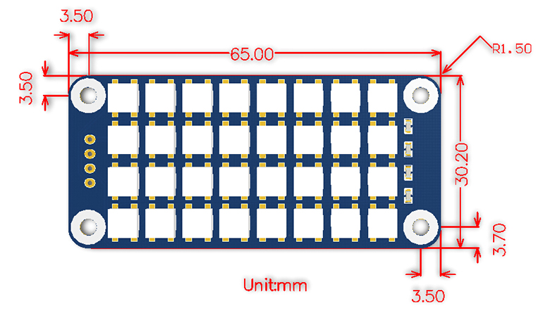
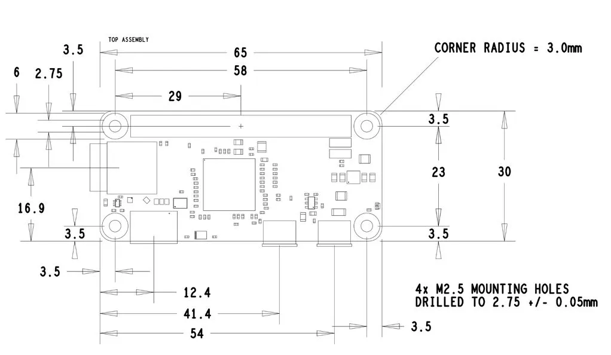
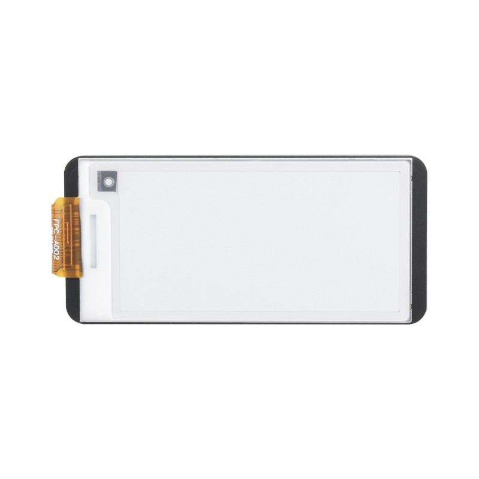
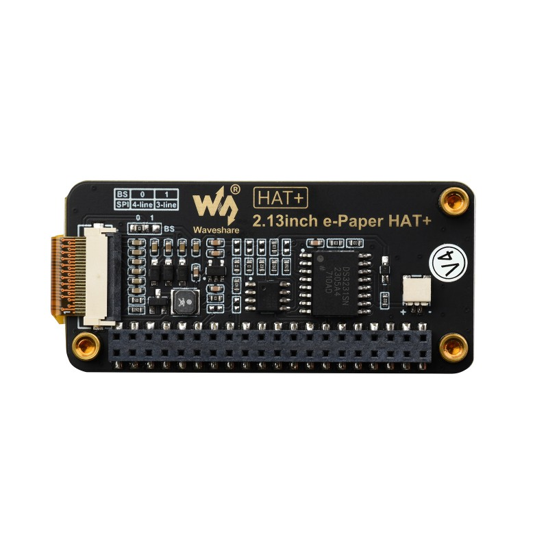

# Wave Share

This directory contains the code for the Waveshare devices.

## True color RGB LED HAT for Raspberry Pi



### Description
Access the RGB LED HAT for Raspberry Pi required pip installation:

```bash
pip install rpi_ws281x
```
Find the latest libraries here: https://github.com/jgarff/rpi_ws281x
And the Python bindings here: https://github.com/rpi-ws281x/rpi-ws281x-python

rpi_ws281x introduces a new class called `PixelStrip` which is used to control the strip.
The `PixelStrip` class is initialized with the number of pixels, the GPIO pin to use, and the pixel format.
It defaults to using the GPIO pin 18 and the WS2811 pixel format.

## 2.13inch E-Paper HAT+ For Raspberry Pi, E-Ink Display, 250x122




Product Documentation: https://www.waveshare.com/wiki/2.13inch_e-Paper_HAT+
The raspberry pi e-paper HAT+ is a 2.13inch e-paper display with a resolution of 250x122 pixels. 
The display is monochrome and uses the SPI interface to communicate with the Raspberry Pi.
Identifying that the display is connected to the Raspberry Pi can be done checkin the Real Time Clock (RTC) chip on the HAT+.
However that requires that i2c is enabled on the Raspberry Pi as well.

Both, SPI and I2C, can be enabled in the Raspberry Pi configuration tool: `sudo raspi-config`
/boot/firmware/config.txt needs to have the following lines added to enable SPI and I2C:

```
dtparam=i2c_arm=on
dtparam=spi=on
```
The required libraries for the e-paper HAT+ can be installed via apt:
  - python3-numpy
  - python3-pil
  - python3-spidev
  - python3-smbus
  - python3-gpiozero

The python bindings for the e-paper HAT+ can be found here: https://github.com/waveshareteam/e-Paper
The driver for this particular display is located https://github.com/waveshareteam/e-Paper/blob/master/RaspberryPi_JetsonNano/python/lib/waveshare_epd/epd2in13_V4.py
  - epd2in13_V4.py is the driver for the 2.13inch e-paper HAT+.
  - epdconfig.py configures how e-paper HATs connected to the Raspberry Pi.
  - DS3231.py is the driver for the Real Time Clock (RTC) chip on the HAT+.
  - IC2C_config.py is the I2C driver for the Raspberry Pi.

### epd2in13_V4

The `epd2in13_V4` module contains the EPD class which is used to control the e-paper display.
This class has lower and higher level methods to control the display. 